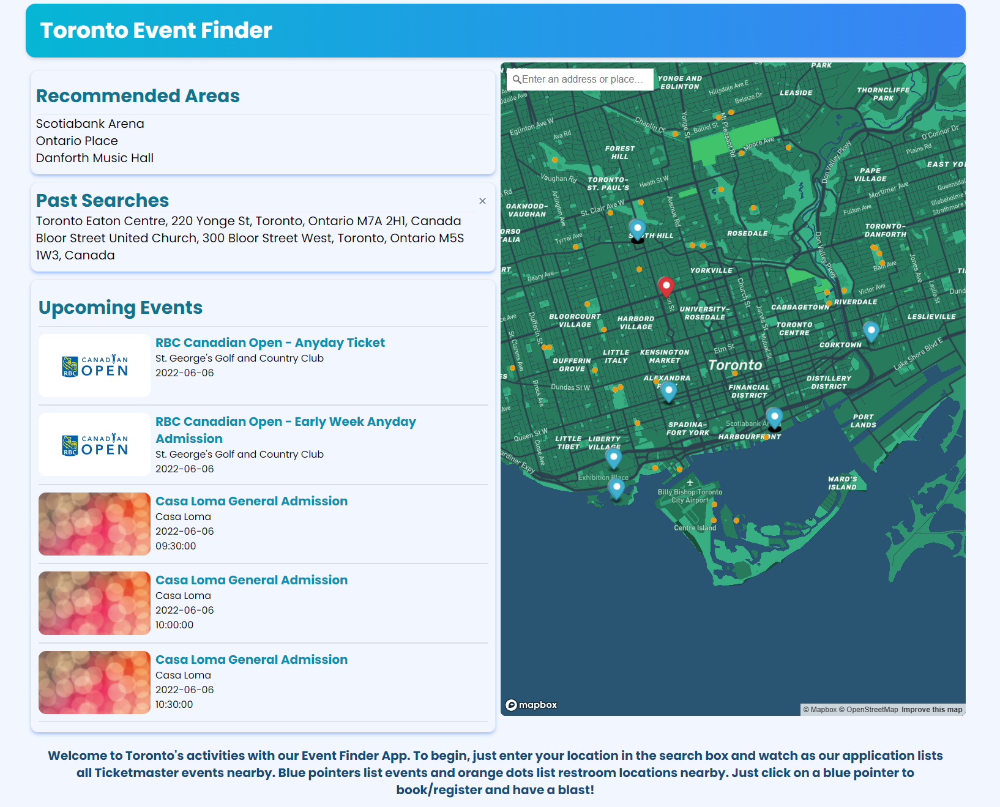

# Toronto-Event-Finder

## ✏️ Description
   Are you bored in Toronto? Feeling like going to a Event near you? Look no further!
   The Toronto Event-Finder app locates near by events in Toronto! It presents a map of Upcoming Event options by guiding users with a visualization of marked event locations.

## 👥User Story
- User wants to be able to find events in TO
- User wants to be able to view the event location, name of the event and the date and time
- The marked event location allows the user to be riderected to book tickets for the event
- User wants to see past searches on the side of the map
- A map of the location is displayed with a set radius of 2km

## Expectations 
- When the Map Loads, The uset finds themselves looking at the Map of Toronto
   - The yellow markers on the map are dispalyed as locations for near by public washrooms
   - The blue markers on the map are locations for upcoming events in Toronto
   - Search Location will display results of searches within the map
   - Searched Locations will display on the side
   - Clicking on the previous search results will return reroute user to the previous searched location 
   - User is able to clear previous Locally Stored Searches

## Task List
1) Familiarize selves with API documentation for MapBox API, TicketMaster API
2) Perform successful fetch requests for both APIs to view data
3) Use API data to populate page with location based information for event options within an area in Toronto
4) Use local storage to allow users to view location based data based on previous area searches

## 📜Table of Contents
- [Description](#description)
- [User Story](#👥user-story)
- [Expectations](#expectations)
- [Task List](#task-list)
- [Images and Screenshots](#images-and-screenshots)
- [Deployed Link](#deployed-Link)
- [Wireframe](#wireframe)
- [References](#References)

## 🖼️ Images and Screenshots
 

## Deployed Link
 - [Try out the Toronto Event Finder](https://benbasic.github.io/Toronto-Event-Finder/)
 
## Wireframe
- [Figma Wireframe](https://www.figma.com/file/RZhzRnK6eMB49M3BBlxbzu/Toronto-Healthy-Food-Finder?node-id=0%3A1)

## 📝 Reference Links
- [Toronto Washroom Facility](https://www.toronto.ca/explore-enjoy/recreation/spring-summer-washrooms-in-parks-recreation-facilities/)
- [Toronto Washroom Dataset](https://ckan0.cf.opendata.inter.prod-toronto.ca/gl/dataset/washroom-facilities)
- [MapBox Tilequery API](https://docs.mapbox.com/api/maps/tilequery/)
- [MapBox GeoCoding API](https://docs.mapbox.com/api/search/geocoding/)
- [TicketMaster API](https://developer.ticketmaster.com/products-and-docs/apis/discovery-api/v2/)
- [Pexels Toronto](https://www.pexels.com/search/toronto/)
- [Huemint](https://huemint.com/brand-3/#palette=fefefe-232b2f-295472-38af83)

